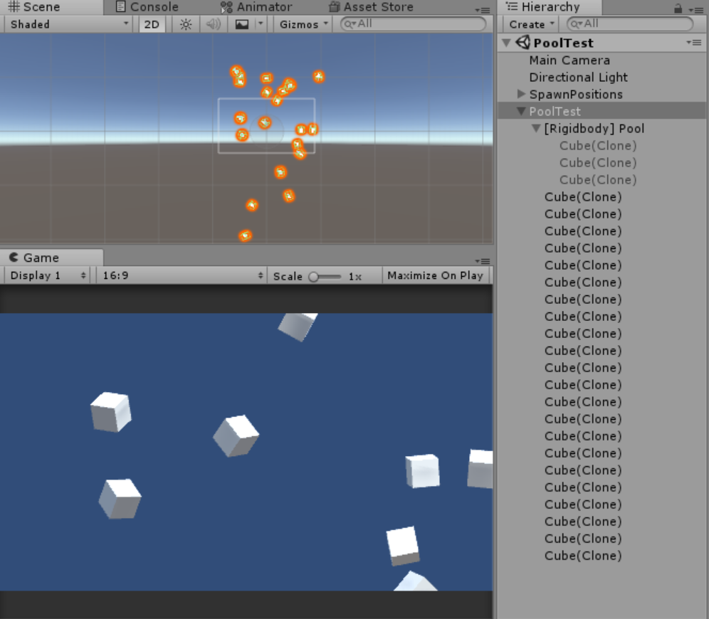
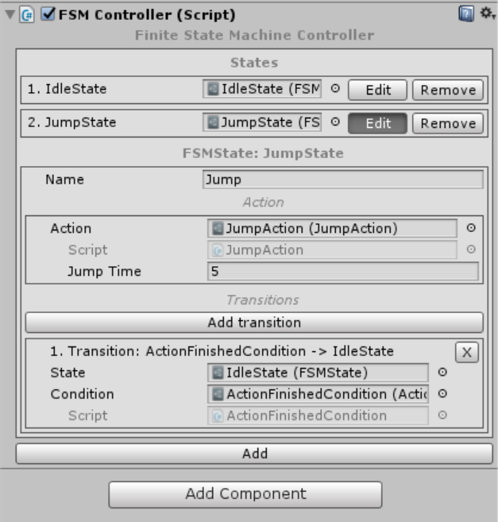
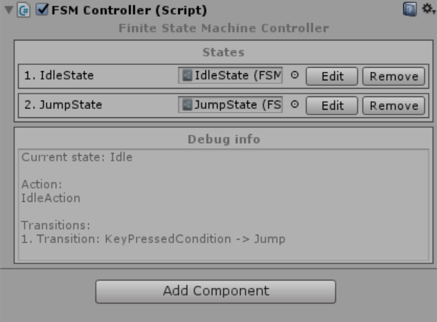
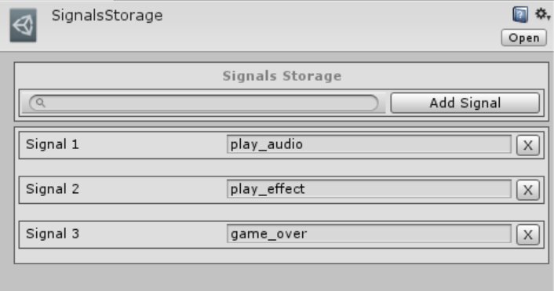
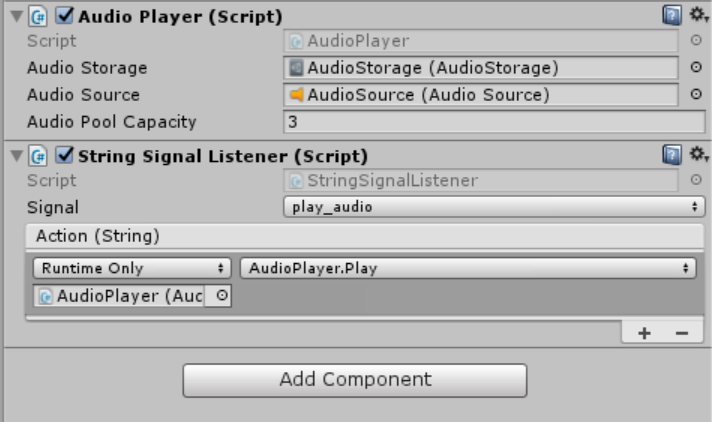
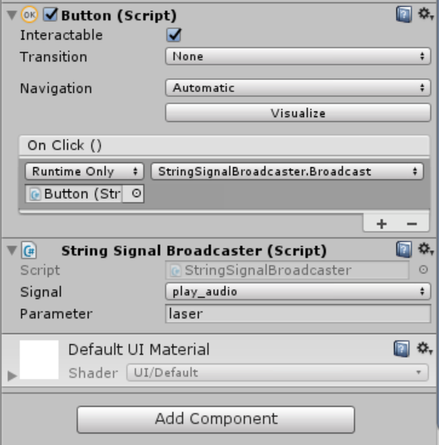
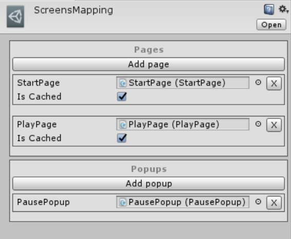
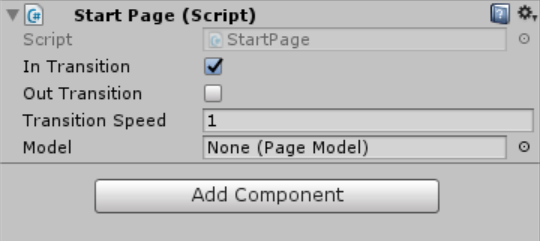
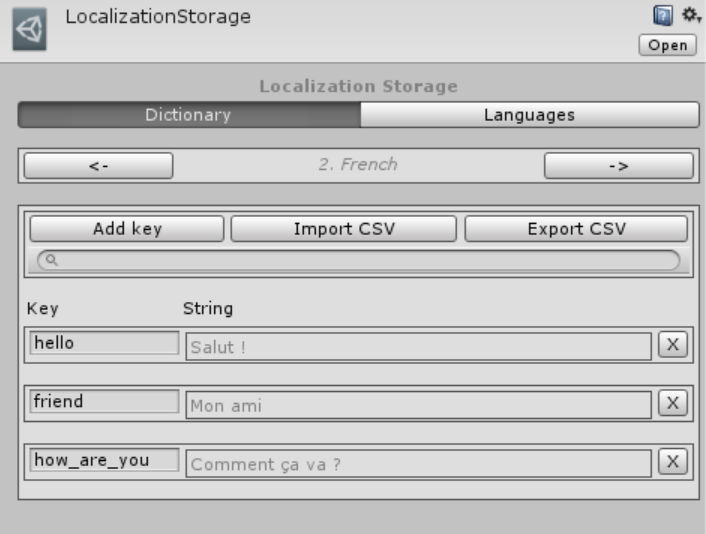
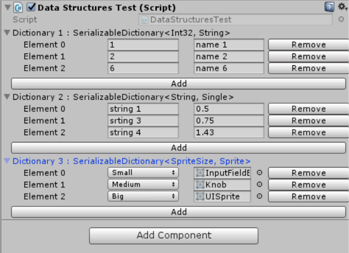

# Unity-Game-Framework

This is a framework that is used for rapid game development and prototyping using Unity. It includes some common design patterns, algorithms and techniques such as Objects Pool, State Machine, Events System, UI System, Localization and more.

### Pool

Pool allows you to reuse instantiated objects instead of instantiating/destroying new objects each time. This saves a lot of CPU time and helps to avoid GC calls.

```
//Create the pool
var pool = new Pool<Rigidbody>(Prefab, ParentTransform, PoolCapacity);

//Get the next item from the pool and process it
var item = pool.GetNext();

//Return the used item back to the pool
pool.Return(item);
```



### State Machine

There are 2 State Machine implementations: simple and more complex, based on Scriptable Objects. 

Simple State Machine can be used as follows:

```
public enum State
{
    A,
    B,
    C
}

//Create and configure the State Machine
var stateMachine = new StateMachine<State>(State.A);
stateMachine.AddTransition(State.A, State.B, ProcessABTransition);
stateMachine.AddTransition(State.B, State.C, ProcessBCTransition);
stateMachine.AddTransition(State.C, State.A, ProcessCATransition);

//Change the state
stateMachine.SetState(State.B);
```
FSM based on Scriptable Objects can be configured right in the FSMController component. All the states, actions and conditions are Scriptable Objects that have custom editors.



During the Play Mode, the FSMController component displays debug information regarding the current state.



### Event System

Decoupled Event System called "Signals" allows you to build event/callback based behaviour in an efficient and easy way. It provides Broadcasters and Listeners for all basic types such as int, float, string, Vector3 (can be extended to support custom types as well). 

Signal itself is a string based entity that is defined in the Signal Storage asset.



To subscribe to a specific signal add SignalListener component to a game object, select the signal and add a callback or use the following structure:

```
SignalsManager.Register(SignalName, CallbackMethod);
```



To broadcast a signal add SignalBroadcaster component, specify the Signal and Parameter to broadcast and trigger Broadcast method from code or as a Button callback.

```
SignalsManager.Broadcast(SignalName, Parameter);
```



### UI System

UI system provides a simple and convenient way to navigate through the pages and popups. 

```
//Open the StartPage
NavigationManager.Instance.OpenScreen<StartPage>();

//Show the PausePopup
NavigationManager.Instance.ShowPopup<PausePopup>();
```

All available screens are defined in ScreensMapping asset. The “Is Cashed” flag determines whether the screen should be instantiated only once and then reused or instantiated/destroyed each time.



All pages and popups inherited from the base Screen class support an In/Out transition animation, which can be extended or overridden.



### Localization

Localization system provides tools for translating the in-game strings into different languages. The centre of the system is the LocalizationStorage asset, which is used for efficient and organized storing the strings. It supports CSV files export/import and allows to add/edit strings directly in the inspector.



For static strings, the TextLocalizer component can be used. It identifies the string by a key that is assigned to the string in LocalizationStorage and automatically handles cases where the current language has been changed. 

Dynamic strings are handled as follows:

```
//Get the string by a key
var text = LocalizationManager.GetString(key);
```

### Serializable Dictionary

SerializableDictionary is a workaround of Unity limitations in serializing the Dictionary class. It can be used as a replacement to Scriptable Objects when you need to define a simple key/value based configuration. Has a custom property drawer that allows you to add, edit and remove items.



To create new custom Serializable Dictionary you need to create 2 classes inherited from SerializableDictionary<TKey, TValue> and SerializableDictionaryEditor<TKey, TValue>.

```
//Create an actual Serializable Dictionary class
[Serializable]
public class StringFloatSerializableDictionary : SerializableDictionary<string, float>
{
}

//Create its Property Drawer
[CustomPropertyDrawer(typeof(StringFloatSerializableDictionary))]
public class StringFloatSerializableDictionaryEditor : SerializableDictionaryEditor<string, float>
{
}
```
